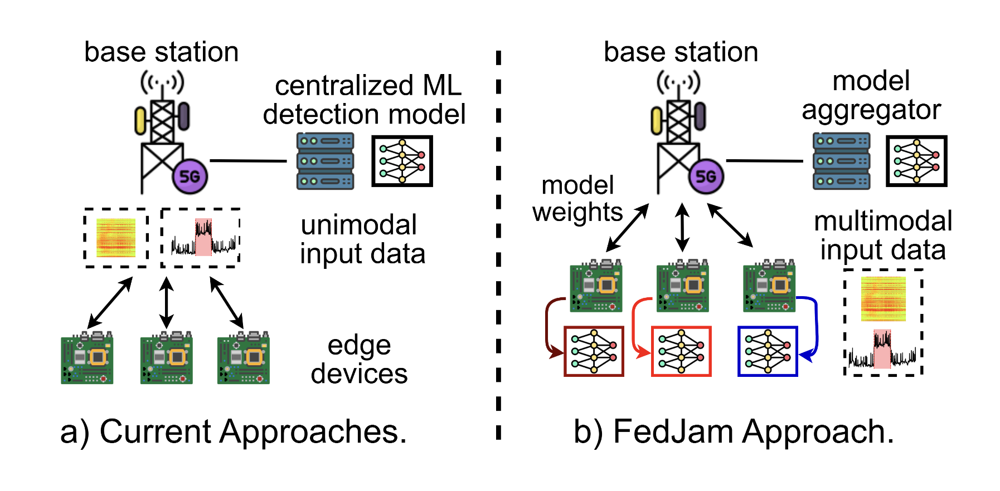
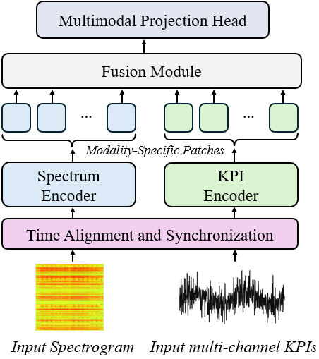

# FedJam: Multimodal Federated Learning Framework for Jamming Detection


## 🔍 Overview

**FedJam** is a **multimodal federated learning (FL)** framework designed for **on-device jamming detection** and classification in wireless networks. Unlike traditional unimodal or centralized approaches, FedJam fuses **spectrograms** and **cross-layer network KPIs** using a lightweight **dual-encoder architecture** enhanced with a **fusion module** and **multimodal projection head**. This enables **privacy-preserving** learning and inference without transmitting raw data.

You can find a visual summary of what FedJam introduces in **Figure 1** (below), and a detailed view of the system architecture in **Figure 2**.

### 🧭 Fig. 1: FedJam Overview
<p align="center">
  
</p>

FedJam is:

- 🌐 **Federated**: Enables decentralized, privacy-preserving learning across devices.
- 📶 **Multimodal**: Jointly leverages time-frequency (spectrogram) and network-layer KPI data.
- 💡 **Lightweight**: Efficient dual-encoder model suitable for on-device deployment.
- 📉 **Efficient**: Requires up to **60% fewer** communication rounds to converge.
- 🛡️ **Robust**: Maintains performance under heterogeneous data distributions.

### 🛠️ Fig. 2: System Architecture
<p align="center">
  
</p>

---

## 📁 Repository Structure

```

.
├── code/
│   ├── fedjam-flower/        # Federated training scripts using Flower
│   └── ...                   # Additional utilities, models, configs, scripts
├── data/
│   └── sample_dataset.zip    # Sample spectrogram and KPI data in 
│                             # HuggingFace format (Needs to be unzipped)
├── figures/                  # README figures
├── requirements.txt          # Python dependencies
├── .gitignore
├── README.md                 # This file
└── LICENSE

````

---

## 🚀 Getting Started

### 1. Clone the repository

```bash
git clone https://github.com/your-org/fedjam.git
cd fedjam
````

### 2. Install dependencies

We recommend creating a virtual environment:

```bash
python -m venv venv
source venv/bin/activate
pip install -r requirements.txt
```

---

## 🧪 Running Simulations with Flower

The federated training simulation using [Flower](https://flower.ai/) is located in `code/fedjam-flower/`.
Modify `pyproject.toml` based on your experiment configurations.

```bash
cd code/fedjam-flower
flwr run
```

---

## 📊 Sample Dataset

A small subset of the full dataset is provided under the `data/` directory for quick testing and experimentation. It includes:

* `.png` images for spectrograms
* Corresponding `.csv` files for KPI measurements
* Labels for benign and three jamming attack types

The full dataset will be publicly released upon publication of the paper.

---

## License

The code in this repository is licensed under the [MIT License](LICENSE).
